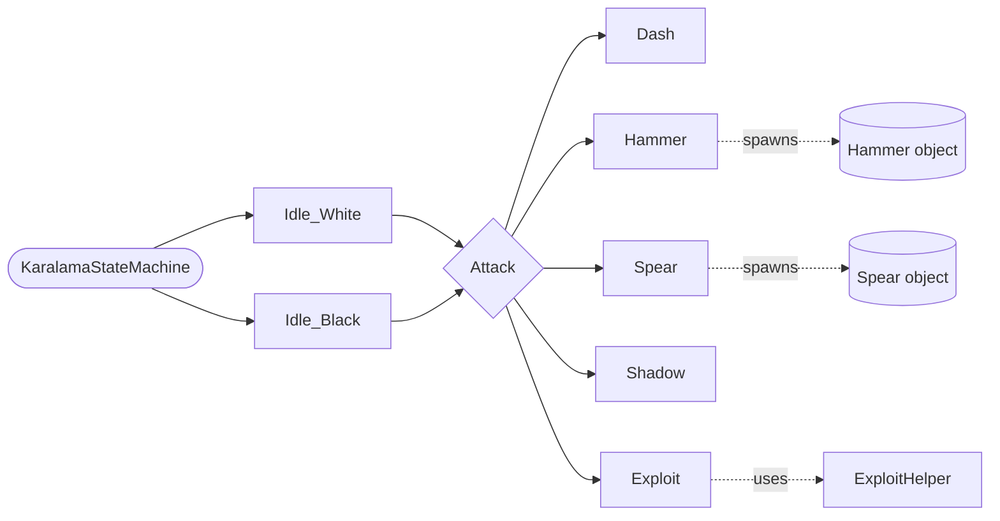
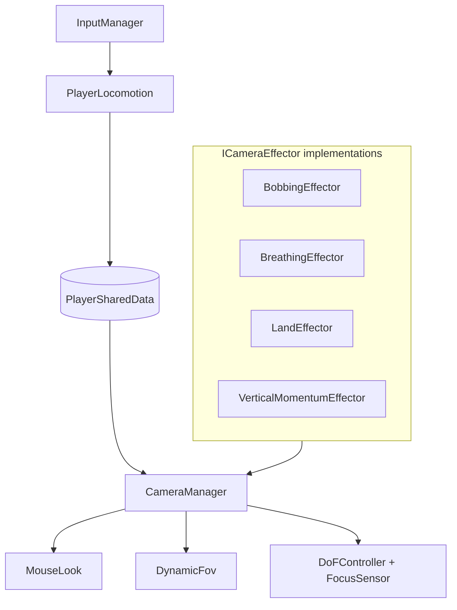
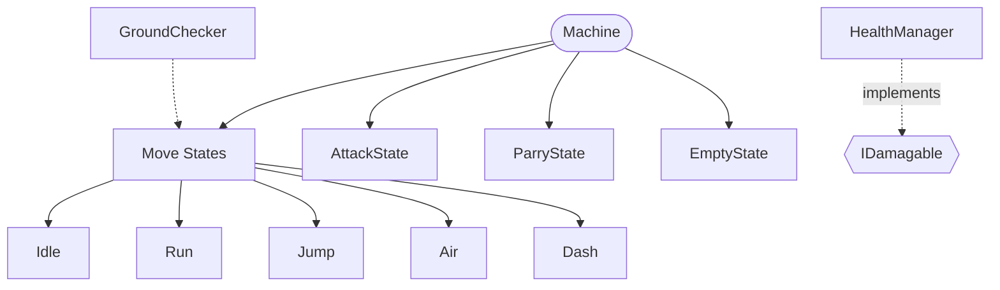
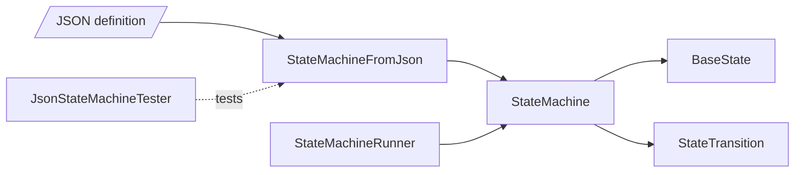
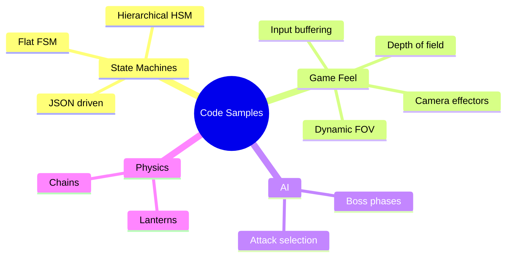

<div align="center">

# 🎮 Gameplay Systems — Code Samples

**Selected Unity / C# systems from my projects: boss AI, player controllers, camera feel, input and state machines.**


[Boss AI](#-boss-ai--karalama) •
[FPS Controller](#-first-person-controller) •
[2D Controller](#-modular-2d-player-controller) •
[State Machine](#-state-machine-framework) •
[Input](#-buffered-input-manager) •
[Weapons](#-weapon-system)

</div>

---

## 📦 What's Inside

| Module | What it shows | Key patterns |
|---|---|---|
| 👹 **Boss AI — Karalama** | A multi-phase boss with distinct attack states and physics-driven arena props | FSM, phase switching, physics |
| 🎥 **First Person Controller** | Player locomotion plus a layered camera-feel system | FSM, interface-based effectors, post-processing |
| 🕹️ **Modular 2D Player Controller** | Platformer controller with movement, dash, attack and parry | Hierarchical State Machine (HSM) |
| 🧠 **State Machine Framework** | Reusable state machine that can be built from JSON | Data-driven design |
| ⌨️ **Buffered Input Manager** | Input buffering so actions pressed slightly early still register | Input buffering |
| ⚔️ **Weapon System** | Weapon handling and switching | Manager pattern |

> These are extracted snippets, not complete projects. Each folder is meant to be read, not dropped into a scene as-is.

---

## 👹 Boss AI — Karalama

<!-- <p align="center"></p> -->

A boss fight driven by a dedicated state machine. The boss moves between two idle modes (**White** and **Black**) and chooses from a set of attack states. The arena itself reacts too, with chains and swinging lanterns simulated through physics.



<details>
<summary><b>📁 Files</b></summary>

```
Boss AI - aka karalamaboss/
├── Enviroment/
│   ├── ChainManager.cs        # chain behaviour in the arena
│   └── LanternPhysics.cs      # physics-driven lanterns
├── States/
│   ├── Dash.cs
│   ├── Exploit.cs
│   ├── Hammer.cs
│   ├── Idle_Black.cs
│   ├── Idle_White.cs
│   ├── Shadow.cs
│   └── Spear.cs
├── ExploitHelper.cs
├── Hammer.cs                  # hammer weapon object
├── KaralamaStateMachine.cs    # the boss brain
└── Spear.cs                   # spear weapon object
```
</details>

---

## 🎥 First Person Controller

<!-- <p align="center"></p> -->

A first-person controller split into **locomotion** and **camera feel**. Every camera effect is its own small class implementing `ICameraEffector`, and `CameraManager` combines them. New effects can be added without touching existing ones.



| Effect | Feel |
|---|---|
| Bobbing | Head sway while walking |
| Breathing | Subtle idle movement |
| Land | Camera dip on landing |
| Vertical Momentum | Camera reacts to jumping and falling |
| Dynamic FOV | Field of view shifts with speed |
| Depth of Field | Auto-focus on what the player looks at |

<details>
<summary><b>📁 Files</b></summary>

```
FirstPersonController/
├── Camera/
│   ├── PostProcess/
│   │   ├── DoFController.cs
│   │   └── FocusSensor.cs
│   ├── BobbingEffector.cs
│   ├── BreathinEffector.cs
│   ├── CameraManager.cs
│   ├── DynamicFov.cs
│   ├── ICameraEffector.cs
│   ├── LandEffector.cs
│   ├── MouseLook.cs
│   └── VerticalMomentumEffector.cs
├── Controller/
│   ├── InputManager.cs
│   └── PlayerLocomotion.cs
├── FSM/
│   ├── FSM.cs
│   └── IState.cs
└── PlayerSharedData.cs
```
</details>

---

## 🕹️ Modular 2D Player Controller

<!-- <p align="center"></p> -->

A 2D controller built on a **Hierarchical State Machine**. Movement states live under a shared parent, so common logic like gravity and ground checks is written once instead of copied into every state.



<details>
<summary><b>📁 Files</b></summary>

```
Modular 2D Player Controller/
├── HSM/
│   ├── States/
│   │   ├── MoveStates/
│   │   │   ├── AirState.cs
│   │   │   ├── DashState.cs
│   │   │   ├── IdleState.cs
│   │   │   ├── JumpState.cs
│   │   │   └── RunState.cs
│   │   ├── AttackState.cs
│   │   ├── EmptyState.cs
│   │   └── ParryState.cs
│   ├── Controller.cs
│   ├── Machine.cs
│   └── State.cs
├── Weapon/
├── GroundChecker.cs
├── HealthManager.cs
└── IDamagable.cs
```
</details>

---

## 🧠 State Machine Framework

A reusable, general-purpose state machine. States and transitions can be defined in **JSON** and built at runtime, so behaviour can be changed without recompiling.



<details>
<summary><b>📁 Files</b></summary>

```
StateMachine/
├── JSON/
│   ├── JsonStateMachineTester.cs
│   └── StateMachineFromJson.cs
├── BaseState.cs
├── StateMachine.cs
├── StateMachineRunner.cs
└── StateTransition.cs
```
</details>

---

## ⌨️ Buffered Input Manager

Stores player inputs for a short window, so a jump pressed a few frames before landing still fires. A small system that makes controls feel noticeably more forgiving.

```
Buffered Input Manager/
└── InputManager.cs
```

---

## ⚔️ Weapon System

Handles equipping and switching weapons.

```
WeaponSystem/
└── WeaponManager.cs
```

---

## 🛠️ Patterns at a Glance



---

<div align="center">

## 📫 Contact

[](https://www.linkedin.com/in/ahmet-%C3%A7evik-c7/)
[](mailto:ahmetcevik774@gmail.com)

<sub>Licensed under the MIT License. See <a href="LICENSE">LICENSE</a>.</sub>

</div>
