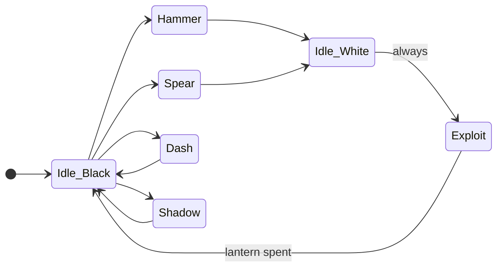
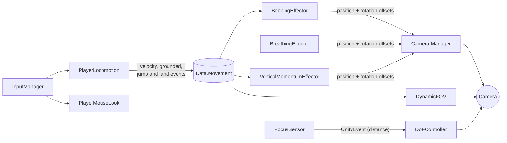
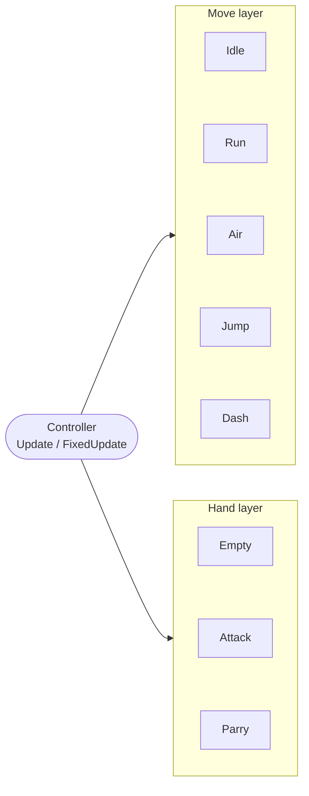
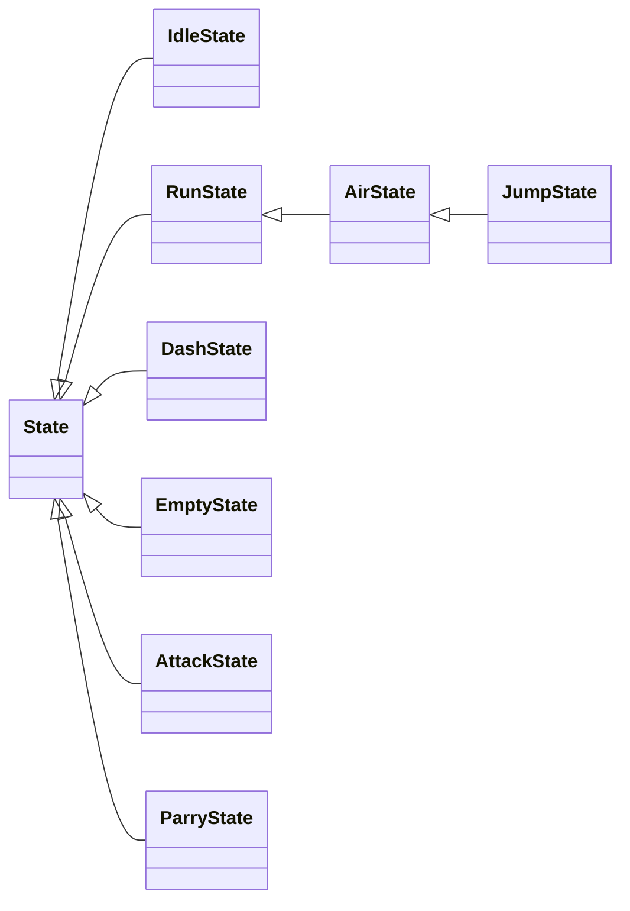
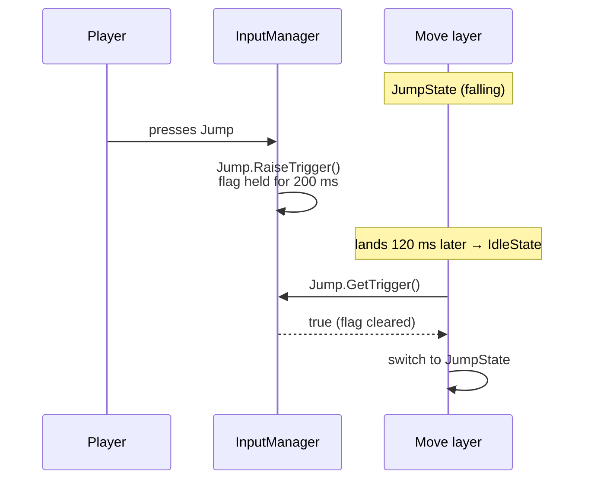

<a id="readme-top"></a>

<picture>
  <source media="(prefers-color-scheme: dark)" srcset="docs/banner-dark.svg">
  <source media="(prefers-color-scheme: light)" srcset="docs/banner-light.svg">
  
</picture>

<p align="center">
  
  
  
  
  
  
</p>

<p align="center">
  <a href="#boss-ai-karalama">Boss AI</a> &nbsp;|&nbsp;
  <a href="#first-person-controller">First-person controller</a> &nbsp;|&nbsp;
  <a href="#modular-2d-player-controller">2D controller</a> &nbsp;|&nbsp;
  <a href="#buffered-input-manager">Input buffering</a> &nbsp;|&nbsp;
  <a href="#state-machines">State machines</a> &nbsp;|&nbsp;
  <a href="#dependencies">Dependencies</a> &nbsp;|&nbsp;
  <a href="#known-limitations-and-roadmap">Roadmap</a>
</p>

Gameplay code from my Unity projects: a 2D boss that fights with its own arena, a first-person camera built from stackable effects, a 2D action controller that lets you attack mid-jump, and the input and state-machine plumbing underneath them. About 4,000 lines of C# across 52 files.

> [!NOTE]
> These are **extracted snippets, not complete projects**. They're meant to be read, not dropped into a scene: some files reference project classes that aren't in this repo. [Dependencies](#dependencies) lists exactly which.

<!--
  🎬 Biggest missing piece: gameplay GIFs. Record 6–10 s loops, 800 px wide, under ~8 MB each,
  save them to docs/media/, then replace each "GIF slot" comment below with:
  <p align="center"></p>
-->

## Where to start

Short on time? Each row is a self-contained path through the code.

| Time | Read | What it shows |
|---|---|---|
| 2 min | [`InputSignal`](Buffered%20Input%20Manager/InputManager.cs) | Input buffering with consume-on-read, in about 30 lines |
| 5 min | [`ICameraEffector`](FirstPersonController/Camera/ICameraEffector.cs) → [`CameraManager`](FirstPersonController/Camera/CameraManager.cs) → [`VerticalMomentumEffector`](FirstPersonController/Camera/VerticalMomentumEffector.cs) | Camera feel as a stack of independent, event-driven effects |
| 10 min | [`KaralamaStateMachine`](Boss%20AI%20-%20aka%20karalamaboss/KaralamaStateMachine.cs) (`MakeRandomAttackDecision`) → [`Spear`](Boss%20AI%20-%20aka%20karalamaboss/Spear.cs) | Boss attack selection, and a projectile that turns into part of the arena |
| 10 min | [`Controller`](Modular%202D%20Player%20Controller/HSM/Controller.cs) → [`JumpState`](Modular%202D%20Player%20Controller/HSM/States/MoveStates/JumpState.cs) | Two state layers running at once, plus coyote time, jump buffering and variable jump height |

## At a glance

| Module | Shape | Files | Lines | Built on |
|---|---|---:|---:|---|
| [Boss AI: Karalama](#boss-ai-karalama) | 7-state FSM with physics props | 13 | 1,342 | `Core.StateMachine`, DOTween, 2D physics |
| [First-person controller](#first-person-controller) | `CharacterController` plus a camera effector stack | 15 | 982 | Input System, Post Processing v2 |
| [Modular 2D player controller](#modular-2d-player-controller) | Two concurrent state layers | 16 | 972 | 2D physics, Buffered Input Manager |
| [State machine core](#state-machines) | Predicate-driven FSM, JSON prototype | 6 | 350 | Plain C# |
| [Buffered Input Manager](#buffered-input-manager) | Per-action buffer windows | 1 | 127 | Input System |
| [Weapon System](#archive-weapon-system) | Early 3-slot inventory (archive) | 1 | 199 | DOTween, uGUI |

<br>

## Boss AI: Karalama

**A 2D boss whose arena is part of its moveset.** Lanterns hang from physics chains; the boss tears them down to attack, and its thrown spears grow back into new lanterns.

<!-- GIF slot: docs/media/boss.gif (hammer slam knocking the lanterns, then a spear pinning the player) -->



Heavy attacks (Hammer, Spear) always route through `Idle_White` into `Exploit`, so each one costs the arena a lantern. Movement attacks (Dash, Shadow) return straight to `Idle_Black`.

| State | What happens |
|---|---|
| **Hammer** | Slams the floor. A line of spikes runs toward the arena edge and every hanging lantern is knocked away from the impact. The hammer head then slides to the player's position and stays behind as a trap. |
| **Spear** | Turns to aim at the player, then throws. On a hit it skewers the player, carries them into the wall and pins them there for 2 s. Afterwards the spear flies to an empty chain, if there is one, and becomes a new lantern. |
| **Dash** | Wind-up, then a random 0.1–0.4 s hesitation so the timing can't be memorised, then a 40 u/s dash to the opposite side of the arena, dropping traps along the path. |
| **Shadow** | Glides to the centre and sends spike waves outward in both directions. Half the time a second wave sweeps back in. Ends on the opposite side of the arena. |
| **Exploit** | Detaches a lantern from its chain, pulls it into position and uses it in the Exploit attack. Lanterns spent here stay gone until a spear replaces them. |

### How it picks an attack

Every 0.3 s spent in `Idle_Black`, [`MakeRandomAttackDecision`](Boss%20AI%20-%20aka%20karalamaboss/KaralamaStateMachine.cs) faces the player and then:

1. Rolls Hammer, Spear, Dash or Shadow, re-rolling anything that repeats the previous attack.
2. Rules out Spear while fewer than two lanterns are hanging.
3. If the player is within 3 units, overrides the roll with Dash about 30% of the time, which gives the boss a way out of close range.

```csharp
do
{
    id = UnityEngine.Random.Range(0, 4);
} while (decisionId == id                                   // no repeats
      || ((e_count == 1 || e_count == 0) && id == 1));      // no Spear on ≤ 1 lantern

if (Vector2.Distance(transform.position, sharedData.player.transform.position) <= dashDecideDistance
    && UnityEngine.Random.Range(0, 100) > 70)
    id = 2;                                                 // close range: dash out
```

### Arena physics

- Lanterns hang from chains of `Rigidbody2D` links on `HingeJoint2D`s.
- [`LanternPhysics`](Boss%20AI%20-%20aka%20karalamaboss/Enviroment/LanternPhysics.cs) passes on a log-compressed share of whatever hits a lantern, `log₂(|v| + 1) · 2` per axis. A light brush nudges it and a dash sends it swinging, while the log curve stops big hits from turning into huge impulses on the joint chain. Two lanterns that touch trade velocity the same way.
- [`ChainManager.ResetChainSmooth`](Boss%20AI%20-%20aka%20karalamaboss/Enviroment/ChainManager.cs) makes the links kinematic, tweens them back to their rest pose, then hands them back to physics with `Physics2D.SyncTransforms()`. It runs when a spear re-hangs a lantern.
- Attack timing is driven by Animation Events (`CreateHammer`, `CreateSpear`, `ShadowIdle`, `ExploitHelper.GoToPlayer`), so animators can retime an attack without touching code.

<details>
<summary><b>Files</b></summary>

| File | Role |
|---|---|
| [`KaralamaStateMachine.cs`](Boss%20AI%20-%20aka%20karalamaboss/KaralamaStateMachine.cs) | The boss brain: shared data, transition wiring, attack selection, animation-event hooks |
| [`States/Idle_Black.cs`](Boss%20AI%20-%20aka%20karalamaboss/States/Idle_Black.cs), [`Idle_White.cs`](Boss%20AI%20-%20aka%20karalamaboss/States/Idle_White.cs) | The two idle modes: decision point and post-attack recovery |
| [`States/Hammer.cs`](Boss%20AI%20-%20aka%20karalamaboss/States/Hammer.cs), [`Spear.cs`](Boss%20AI%20-%20aka%20karalamaboss/States/Spear.cs) | Heavy-attack states; they play the animation that spawns the prop |
| [`States/Dash.cs`](Boss%20AI%20-%20aka%20karalamaboss/States/Dash.cs), [`Shadow.cs`](Boss%20AI%20-%20aka%20karalamaboss/States/Shadow.cs), [`Exploit.cs`](Boss%20AI%20-%20aka%20karalamaboss/States/Exploit.cs) | Movement attacks and the lantern attack |
| [`Hammer.cs`](Boss%20AI%20-%20aka%20karalamaboss/Hammer.cs) | Hammer prop: smash → slide → trap |
| [`Spear.cs`](Boss%20AI%20-%20aka%20karalamaboss/Spear.cs) | Spear prop: aim → throw → pin → becomes a lantern |
| [`ExploitHelper.cs`](Boss%20AI%20-%20aka%20karalamaboss/ExploitHelper.cs) | Animation-event bridge for the Exploit attack |
| [`Enviroment/ChainManager.cs`](Boss%20AI%20-%20aka%20karalamaboss/Enviroment/ChainManager.cs) | Chain rest pose and smooth reset |
| [`Enviroment/LanternPhysics.cs`](Boss%20AI%20-%20aka%20karalamaboss/Enviroment/LanternPhysics.cs) | Log-compressed impact response |

</details>

<p align="right"><sub><a href="#readme-top">Back to top</a></sub></p>

## First-person controller

**A first-person controller tuned for weight.** Jumps have a wind-up, hard landings cost speed, and the camera is a stack of small, independent effects.

<!-- GIF slot: docs/media/fps.gif (walk → jump → hard landing, with the camera dip and FOV change visible) -->

### Locomotion

[`PlayerLocomotion`](FirstPersonController/Controller/PlayerLocomotion.cs) drives a `CharacterController`:

- **Three-stage jump.** A 0.25 s wind-up (movement slowed to 30%), a 0.15 s thrust that ramps up to `√(2gh)`, then airborne. Walking off a ledge during the wind-up cancels the jump.
- **Landing penalty.** Land faster than 4 u/s and speed drops to 10%, then recovers smoothly.
- Separate acceleration and deceleration, 20% air control, and a ground-stick force that keeps `isGrounded` stable.
- The jump wind-up, the launch and every landing (with its impact force) are broadcast through static events on `Data.Movement`, so camera code reacts without knowing the locomotion code exists.

### Camera feel



Each effect is a component implementing `ICameraEffector`. The manager finds them with `GetComponents` and sums their offsets in `LateUpdate`, so adding an effect means adding a component; nothing else changes.

```csharp
interface ICameraEffector
{
    public Vector3 GetPositionOffset();
    public virtual Vector3 GetRotationOffset() { return Vector3.zero; }  // optional
}

// Camera Manager
foreach (var effector in effectors)
    offset += effector.GetPositionOffset();
```

| Component | Technique |
|---|---|
| [`BobbingEffector`](FirstPersonController/Camera/BobbingEffector.cs) | Phase advances with **distance travelled**, not time, so the step rhythm follows speed on its own. Sideways sway runs at half the step frequency, tracing a figure-eight. |
| [`BreathingEffector`](FirstPersonController/Camera/BreathinEffector.cs) | Sine and cosine at two rates, blended with Perlin noise by a `randomness` slider so the idle motion never visibly loops. |
| [`VerticalMomentumEffector`](FirstPersonController/Camera/VerticalMomentumEffector.cs) | Crouches during the jump wind-up, lags behind vertical velocity in the air, and dips on landing in proportion to impact force. Heavy landings add a random roll. Impulses decay first, then go through a second smoothing pass. |
| [`DynamicFOV`](FirstPersonController/Camera/DynamicFov.cs) | Widens from 60° to 70° as speed approaches 6 u/s. |
| [`PlayerMouseLook`](FirstPersonController/Camera/MouseLook.cs) | Pitch input fades out over the last 15° before the ±80° limit instead of stopping dead, plus a small look sway. |
| [`FocusSensor`](FirstPersonController/Camera/PostProcess/FocusSensor.cs) + [`DoFController`](FirstPersonController/Camera/PostProcess/DoFController.cs) | Sphere-casts 10 times a second, reports only changes over 0.1 m, and the controller eases the depth-of-field focus distance toward it. |

<details>
<summary><b>Files</b></summary>

```
FirstPersonController/
├── Camera/
│   ├── PostProcess/
│   │   ├── DoFController.cs          # eases PPv2 depth-of-field focus
│   │   └── FocusSensor.cs            # throttled sphere-cast, UnityEvent output
│   ├── BobbingEffector.cs            # distance-driven head bob
│   ├── BreathinEffector.cs           # class BreathingEffector
│   ├── CameraManager.cs              # class Core.Camera.Manager: sums effector offsets
│   ├── DynamicFov.cs                 # class DynamicFOV
│   ├── ICameraEffector.cs
│   ├── LandEffector.cs               # stub, see roadmap
│   ├── MouseLook.cs                  # class PlayerMouseLook
│   └── VerticalMomentumEffector.cs   # wind-up, air lag, landing impulse
├── Controller/
│   ├── InputManager.cs               # Input System wrapper, smoothed move input
│   └── PlayerLocomotion.cs           # CharacterController locomotion
├── FSM/
│   ├── FSM.cs                        # generic FSM<TContext>, see State machines
│   └── IState.cs
└── PlayerSharedData.cs               # static Data.Movement state and events
```

</details>

<p align="right"><sub><a href="#readme-top">Back to top</a></sub></p>

## Modular 2D player controller

**A 2D action-platformer controller where movement and combat are separate state layers,** so the player can attack while running, jumping or falling without needing a state for every combination.

<!-- GIF slot: docs/media/2d.gif (run → jump → air attack → dash → land into a buffered jump) -->



The [`Controller`](Modular%202D%20Player%20Controller/HSM/Controller.cs) holds one active state per layer and ticks both every frame. States that share behaviour inherit it:



`AirState` reuses `RunState`'s horizontal control and facing, and `JumpState` reuses `AirState`'s gravity and landing checks. (The folder is named `HSM`; strictly speaking this is two orthogonal layers plus state inheritance rather than nested super-states.)

What the player feels:

- **Coyote time** of 0.25 s after walking off a ledge, and a 0.2 s **jump buffer** from the [Buffered Input Manager](#buffered-input-manager).
- **Variable jump height.** Releasing jump cuts upward velocity and raises gravity 7×. The same happens near the apex, so the fall is snappy.
- **Dash** along an `AnimationCurve` with gravity off. One air dash until you touch the ground again, 1 s cooldown.
- **Attack combo** that steps through the weapon's animation list, with damage growing each step and a camera shake on hit. The interrupted movement animation resumes a third of the way into the swing.
- **Taking damage** flashes the sprite red with brief invulnerability, updates the health bar and triggers a hit-stop through `TimeManager`.

Every state is a `[Serializable]` plain C# object tuned in the Inspector, with `onEnter` / `onExit` UnityEvents so VFX and audio can be hooked up without code.

```csharp
void Update()
{
    _moveState?.OnLogicUpdate();   // Idle / Run / Air / Jump / Dash
    _handState?.OnLogicUpdate();   // Empty / Attack / Parry
}

// Both layers share one registry of states; each layer just owns a slot.
public void ChangeHandState<T>() where T : State
{
    TryChangeState<T>(ref _handState);
}
```

<details>
<summary><b>Files</b></summary>

```
Modular 2D Player Controller/
├── HSM/
│   ├── States/
│   │   ├── MoveStates/
│   │   │   ├── AirState.cs       # : RunState, coyote jump, landing checks
│   │   │   ├── DashState.cs      # curve-driven dash, gravity off
│   │   │   ├── IdleState.cs
│   │   │   ├── JumpState.cs      # : AirState, variable height, apex cut
│   │   │   └── RunState.cs       # horizontal control and facing
│   │   ├── AttackState.cs        # combo, hit detection, animation resume
│   │   ├── EmptyState.cs         # hand layer idle
│   │   └── ParryState.cs
│   ├── Controller.cs             # owns both layers, dash and coyote timers
│   ├── Machine.cs                # earlier single-layer machine
│   └── State.cs                  # base state with Inspector data and UnityEvents
├── Weapon/
│   ├── DefaultSwordController.cs # legacy, see roadmap
│   └── Iweapon.cs
├── GroundChecker.cs              # trigger-count ground check
├── HealthManager.cs              # IDamagable, i-frames, hit-stop
└── IDamagable.cs
```

</details>

<p align="right"><sub><a href="#readme-top">Back to top</a></sub></p>

## Buffered Input Manager

**Presses are stored for a short window and consumed when read,** so a jump pressed just before landing still happens, and a single press is never consumed twice. This is the input layer the 2D controller uses.



```csharp
public bool GetTrigger()          // read once, then it's gone
{
    if (trigger) { trigger = false; return true; }
    return false;
}

public void RaiseTrigger()        // a new press restarts the window
{
    if (currentThread != null)
        InputManager.Instance.StopCoroutine(currentThread);
    trigger = true;
    currentThread = InputManager.Instance.StartCoroutine(StartBuffer());
}
```

Each action gets its own window: 200 ms for Jump, 100 ms for Dash, Attack and Parry. `IsJumpHeld` and a one-frame `IsJumpCanceled` feed the variable jump height. Callbacks come from the Input System's generated `IPlayerActions` interface, so there's no string lookup.

[`InputManager.cs`](Buffered%20Input%20Manager/InputManager.cs)

<p align="right"><sub><a href="#readme-top">Back to top</a></sub></p>

## State machines

The repo contains five state-machine shapes, each picked for a different job:

| Implementation | Transitions | State lookup | Used by | Good fit for |
|---|---|---|---|---|
| [`Core.StateMachine`](StateMachine/StateMachine.cs) | Each state owns an ordered list of `Func<bool>` predicates; the first true one wins | Object references | Karalama boss | AI whose flow is driven by flags set from animation events |
| [`Core.FSM<TContext>`](FirstPersonController/FSM/FSM.cs) | Explicit `ChangeState<T>()` | `Dictionary<Type, IState>` | Included, not wired in yet | Player code sharing one typed context |
| [`Player.HSM`](Modular%202D%20Player%20Controller/HSM/Controller.cs) | Each state's `LookForNextState()`; two layers ticked in parallel | `Dictionary<Type, State>` | 2D controller | Action games mixing movement and combat |
| `enum JumpState` in [`PlayerLocomotion`](FirstPersonController/Controller/PlayerLocomotion.cs) | `switch` | Enum | FPS jump | A few short-lived stages inside one component |
| [`DynamicStateMachine`](StateMachine/JSON/StateMachineFromJson.cs) | Parsed from JSON | `Dictionary<string, DynamicState>` | Prototype | Designer-authored graphs |

### Core.StateMachine

[`StateMachineRunner`](StateMachine/StateMachineRunner.cs) is a `MonoBehaviour` base: a subclass overrides `InitializeStates()`, creates its states and wires transitions as lambdas. This is the boss's wiring:

```csharp
_idleBlack.AddTransition(() => sharedData.hammerActive,    _hammer);
_hammer.AddTransition(   () => sharedData.idleWhiteActive, _idleWhite);
_idleWhite.AddTransition(() => sharedData.exploitActive,   _exploit);
_exploit.AddTransition(  () => sharedData.idleBlackActive, _idleBlack);
```

[`BaseState.PlayAnimationAndWait()`](StateMachine/BaseState.cs) fires an Animator trigger, polls until the clip reaches `normalizedTime ≥ 1`, and gives up after 3 s, so a missing clip can't freeze the AI.

> [!IMPORTANT]
> `BaseState` currently takes `KaralamaStateMachine.SharedData` in its constructor, so this core ships together with the boss rather than standing alone. Making it generic is on the [roadmap](#known-limitations-and-roadmap).

### JSON prototype

[`StateMachineFromJson.cs`](StateMachine/JSON/StateMachineFromJson.cs) builds a state graph at runtime from JSON shaped like a Unity Animator Controller, read from `StreamingAssets` by [`JsonStateMachineLoader`](StateMachine/JSON/JsonStateMachineTester.cs):

```json
{
  "layers": [{
    "name": "Base Layer",
    "states": [
      { "name": "Idle",   "transitions": [{ "toState": "Attack", "conditions": [{ "parameter": "inRange", "mode": "If", "threshold": 0 }] }] },
      { "name": "Attack", "transitions": [{ "toState": "Idle",   "conditions": [] }] }
    ]
  }]
}
```

It's a prototype: states and transitions are parsed and linked, but conditions aren't evaluated yet, so it currently follows the first transition of each state.

<p align="right"><sub><a href="#readme-top">Back to top</a></sub></p>

## Archive: Weapon System

An early 3-slot weapon inventory. A pickup fills an empty slot or replaces the least valuable weapon, each slot icon fills up as its cooldown runs, and a gun that runs dry reverts to the starting weapon. It's kept for reference only: it depends on project classes that aren't in this repo and doesn't compile on its own.

[`WeaponManager.cs`](WeaponSystem/WeaponManager.cs)

## Dependencies

Requires **Unity 2021.2 or newer**, because the code uses default interface methods and C# 9's target-typed `new()`.
<!-- Replace with the exact version you used, e.g. "Written and tested in Unity 2022.3 LTS". -->
Unity 6 renamed some 2D physics members (`Rigidbody2D.velocity` → `linearVelocity`, `drag` → `linearDamping`), so it will show obsolete-API warnings.

| Module | Packages | Referenced but not included |
|---|---|---|
| Boss AI | [DOTween](https://dotween.demigiant.com/), Mathematics, Visual Scripting (one unused import) | `Core.StateMachine` from [`StateMachine/`](StateMachine), `IDamagable` from the 2D controller folder |
| First-person controller | Input System, Post Processing Stack v2 (built-in render pipeline) | Generated `InputSystem_Actions` class with `Move`, `Look`, `Jump` and `Attack` actions |
| 2D controller | uGUI (health slider) | `Player.InputManager` from [`Buffered Input Manager/`](Buffered%20Input%20Manager), `CameraShaker`, `ShakeProfile`, `TimeManager` |
| Buffered Input Manager | Input System | Generated `PlayerInputSystem` class with `Movement`, `Jump`, `Attack`, `Parry`, `Dash` and `Interact` actions; `Dialogue.DialogueStarter` |
| State machine core | None | None |
| Weapon System | DOTween, uGUI | `IWeapon`, `GunManager`, `PlayerManager` and HUD classes |

## Known limitations and roadmap

- [ ] **Boss phase 2.** The hook is in `Exploit.OnStart()` and should fire once the arena runs out of lanterns.
- [ ] **Standalone state-machine core.** Make `Core.StateMachine.BaseState` generic over its shared data instead of using the boss's type.
- [ ] **JSON state machine.** Evaluate transition conditions against runtime parameters and attach behaviour to parsed states.
- [ ] **`LandEffector`** is an empty stub; the landing dip currently lives in `VerticalMomentumEffector`.
- [ ] **Action priority and cancel windows.** `ActionPriority` and `cancelWindowStart` are defined on 2D states but not enforced yet.
- [ ] **2D health.** Death handling and low-health post-processing.
- [ ] **Weapon System.** Rewrite against the current input and state code, or retire it.

## Contact

<!-- One line on what you're looking for helps here, e.g. "Open to gameplay programming roles." -->

<p>
  <a href="https://www.linkedin.com/in/ahmet-%C3%A7evik-c7/"></a>
  <a href="mailto:ahmetcevik774@gmail.com"></a>
</p>

<sub>Released under the <a href="LICENSE">MIT License</a>.</sub>
